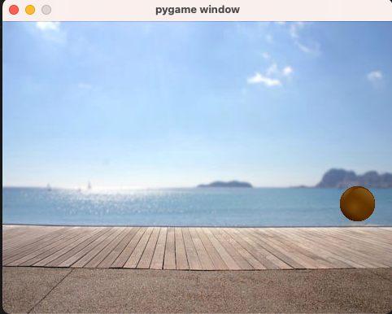

# Summary

## what we talked on class

1. scale the ball to proper size showing on the screen
2. make the ball bounce in the screen

## Homework

1. change the background to use boardwalk.png
2. to make the game window 2 times bigger, add the ball if it is required

use all the files in lession-5 folder. the final result will look like

